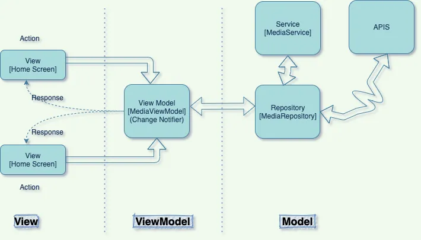
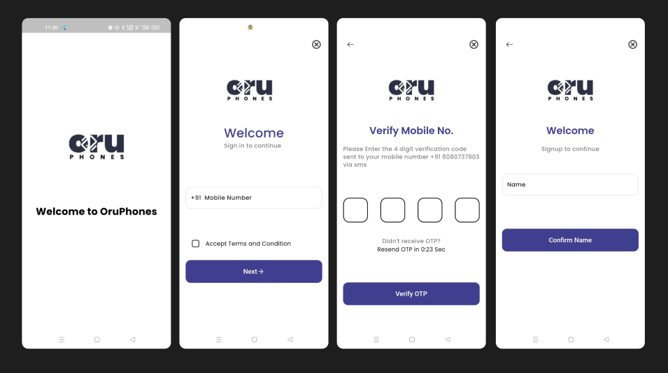
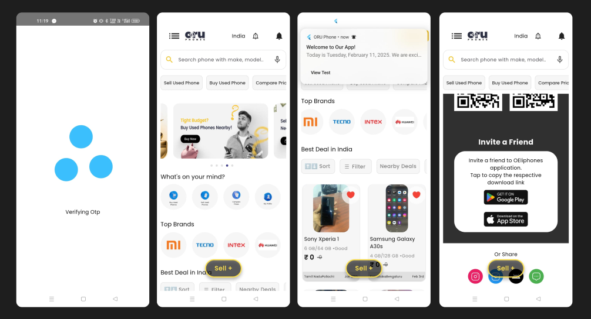
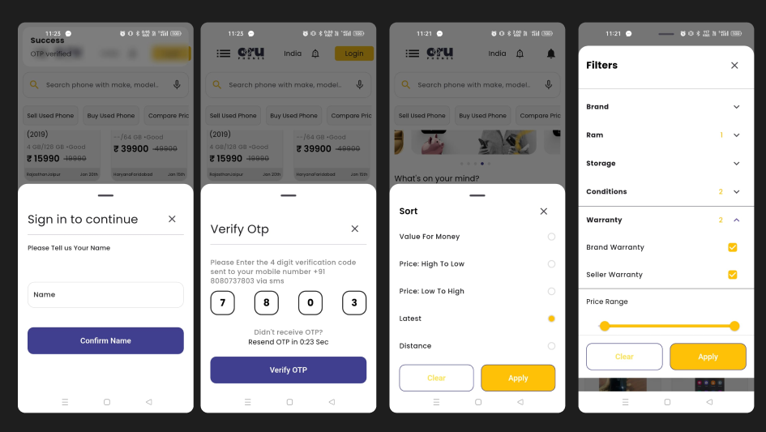
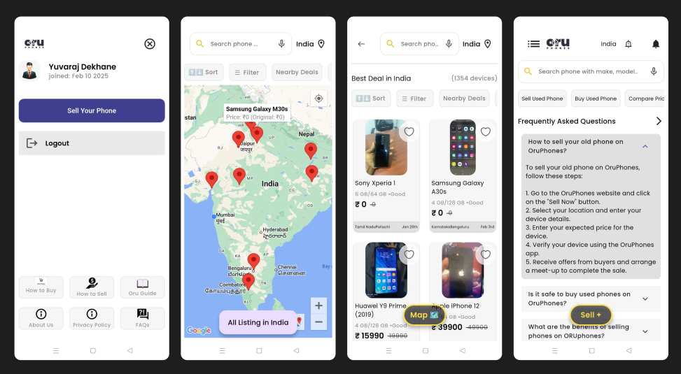

# 🛍️ ORU Phone App

A Flutter-based ORU Phone  application designed to provide a seamless shopping experience.

## 📂 Access Assignment Materials
All necessary materials, including recorded videos and document outputs, are available on Google Drive:

🔗 **[Click here to access the assignment files](https://drive.google.com/drive/folders/11l8MIFQ3XD5Zx7yDcnAm5KxsKhocw6TL?usp=drive_link)**

## 🔄 State Management

### 🔹 **GetX**
- Lightweight and fast state management.
- Manages dependency injection, routing, and state updates efficiently.

### 🔹 **Provider**
- Used for complex state handling and api integration.
- Ideal for sharing state across multiple widgets.

## 🗂️ Local Storage
- **SharedPreferences**: Used for storing small key-value pairs like [Cookies Tokens]

## 🏗️ Architecture
This project follows a **modular architecture** for better scalability and maintainability. The key layers are:

- **Presentation Layer**: Handles UI using Flutter widgets.
- **Business Logic Layer**: Managed by **GetX** and **Provider** for state management.
- **Data Layer**: Handles API calls and local storage (Hive/SharedPreferences).
- 

## 📌 Features
- 📦 **List of Products**: Displays all available products.
- 🗺️ **Google Map Integration**: Shows product locations on the map.
- 🔍 **Sorting, Searching, and Filtering**: Helps users find products easily.
- 🔑 **Authentication**: Secure user login and signup.
- 🎨 **Smooth UI/UX with Responsive Design**: Optimized for different screen sizes.
- 🛠️ **Reusable Widgets**: Modular components for better code maintainability.

## 📸 Output Screens
Here are the key screens of the application with their respective functionalities:

### 🔑 Authentication Screen
Secure login and signup for users.  


### 🏠 Home Screen
Displays a list of products with sorting and filtering options.  


### 📋 Bottom Sheet
Shows additional product details and actions.  


### 🗺️ Google Map Integration
Displays product locations on a map for easy navigation.  



### 1️⃣ Clone the Repository

```bash
git clone https://github.com/yuvaraj8080/newDemo.git
cd oru_ecommerce_app
